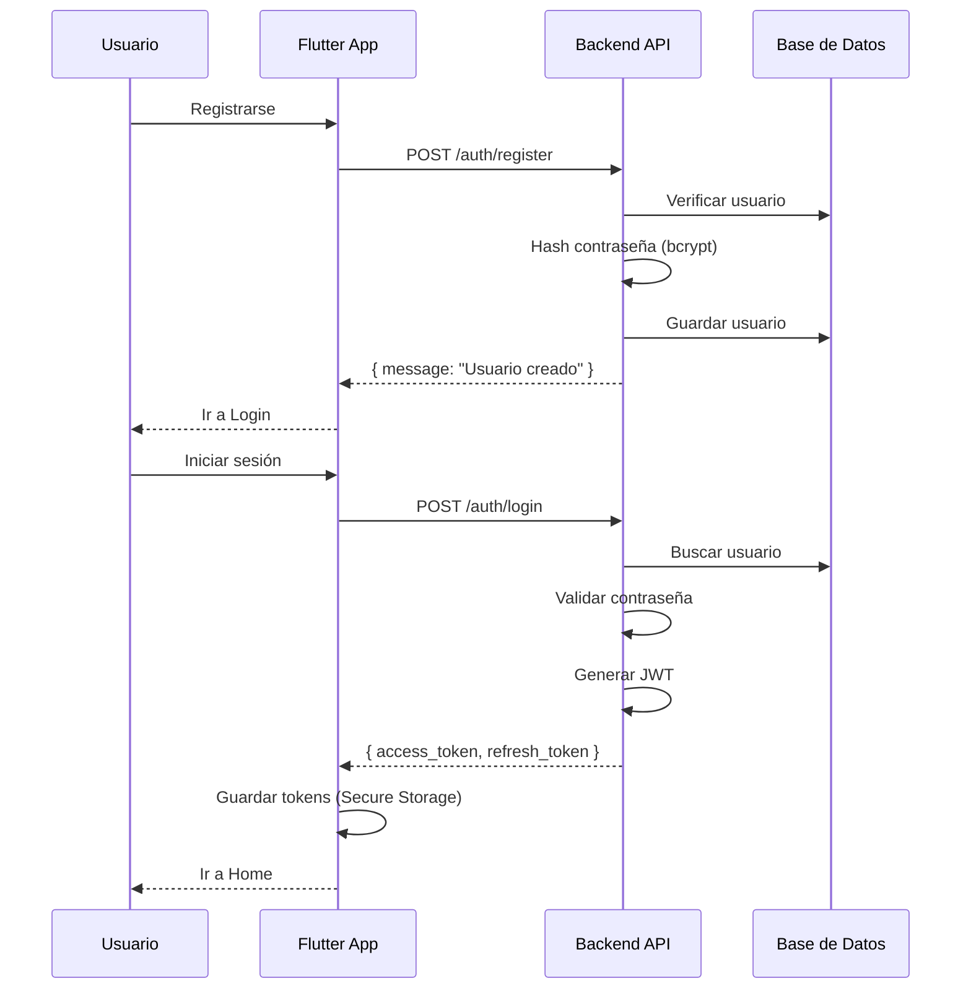
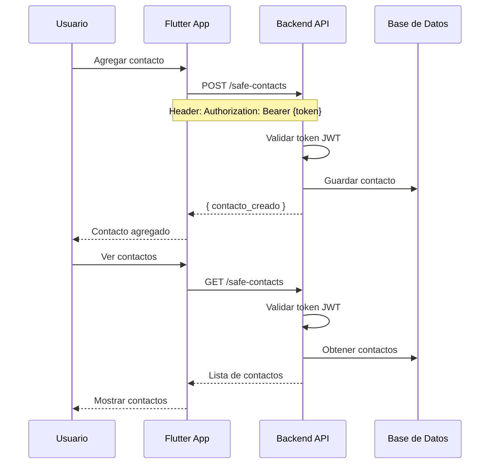
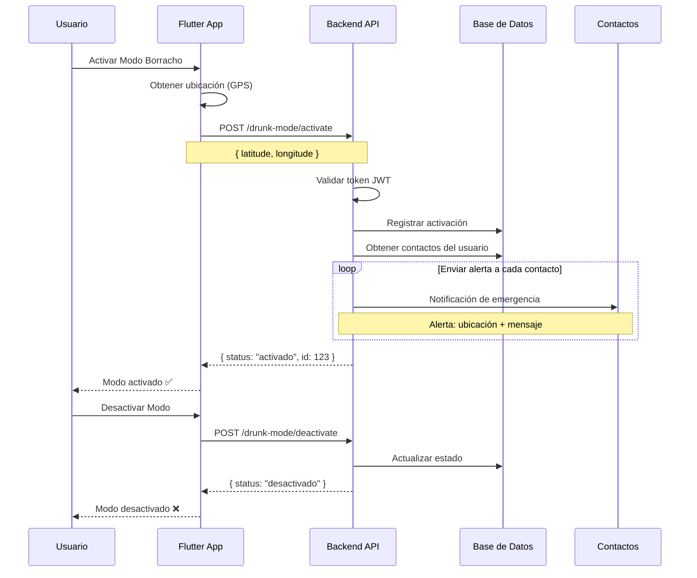
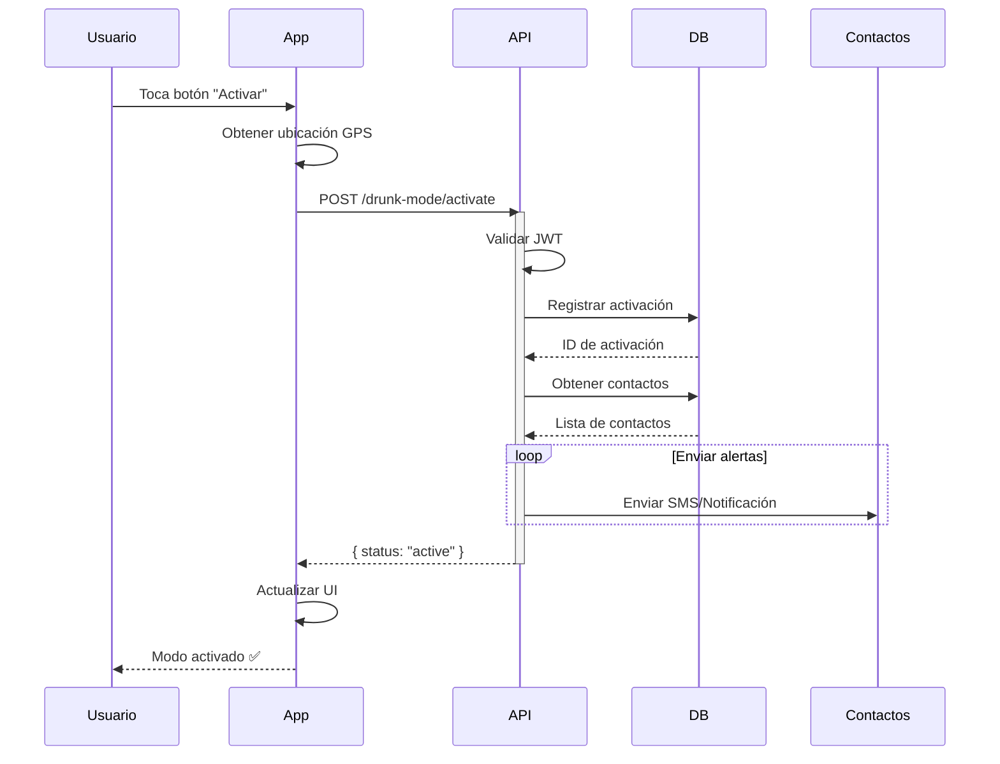
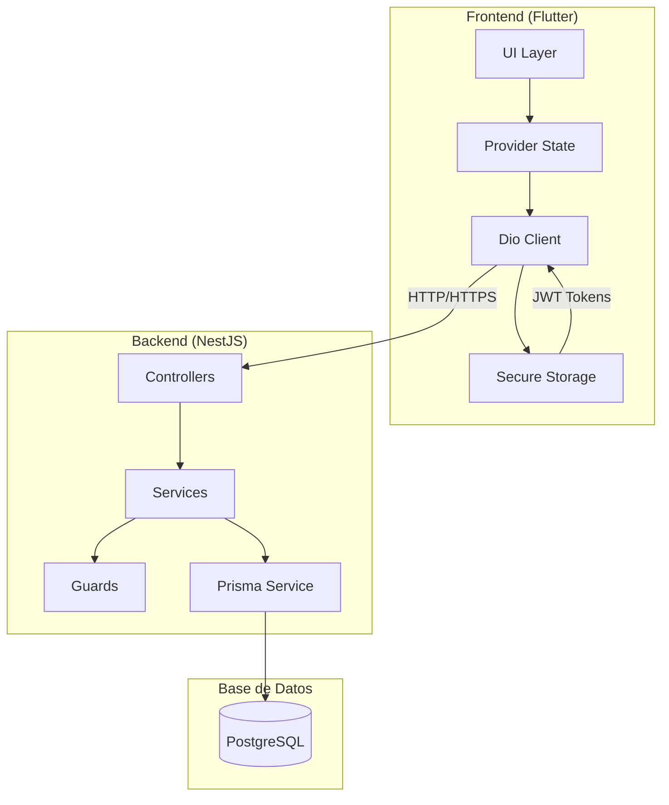

# 🚀 Drunk-Mode - Sistema de Seguridad Ciudadana "Modo Borracho"

## 📋 Índice
- [Descripción General](#descripción-general)
- [Arquitectura del Sistema](#arquitectura-del-sistema)
- [Tecnologías Utilizadas](#tecnologías-utilizadas)
- [Estructura del Proyecto](#estructura-del-proyecto)
- [Flujo de Trabajo](#flujo-de-trabajo)
- [Funcionalidades Principales](#funcionalidades-principales)
- [Configuración y Ejecución](#configuración-y-ejecución)
- [API Endpoints](#api-endpoints)
- [Seguridad](#seguridad)
- [Diagramas](#diagramas)
- [Contribución](#contribución)
- [Licencia](#licencia)

---

## 📖 Descripción General

**Drunk-Mode** es un sistema integral de seguridad ciudadana diseñado para proteger a los usuarios en situaciones de vulnerabilidad, especialmente cuando se encuentran en estado de intoxicación (Modo Borracho). El sistema consta de dos componentes principales:

1. **Backend (NestJS + Prisma):** API RESTful que maneja la lógica de negocio, autenticación, gestión de contactos y activación del modo de emergencia.
2. **Frontend (Flutter):** Aplicación móvil multiplataforma que proporciona una interfaz intuitiva para que los usuarios gestionen su seguridad personal.

### 🎯 Objetivo del Proyecto

Crear una herramienta accesible y confiable que permita a los usuarios:
- Configurar una red de contactos de confianza.
- Activar un modo de emergencia con un solo toque.
- Enviar alertas automáticas con ubicación en tiempo real.
- Mantener un historial de activaciones para seguimiento.

---

## 🏗️ Arquitectura del Sistema

```
┌─────────────────────────────────────────────────────────────────┐
│                         Drunk-Mode SYSTEM                        │
├─────────────────────────────────────────────────────────────────┤
│                                                                  │
│  ┌──────────────┐                    ┌──────────────────────┐   │
│  │   FLUTTER    │   🔒 HTTPS         │      BACKEND         │   │
│  │   FRONTEND   │◄──────────────────►│     (NestJS)         │   │
│  │              │                    │                      │   │
│  │  - UI/UX     │                    │  - Autenticación     │   │
│  │  - Provider  │                    │  - Contactos         │   │
│  │  - Dio       │                    │  - Modo Borracho     │   │
│  │  - Secure    │                    │  - Historial         │   │
│  │    Storage   │                    │                      │   │
│  └──────────────┘                    └──────────┬───────────┘   │
│                                                   │              │
│                                                   ▼              │
│                                          ┌──────────────────┐   │
│                                          │    PRISMA ORM    │   │
│                                          │   PostgreSQL     │   │
│                                          │                  │   │
│                                          │  - Usuarios      │   │
│                                          │  - Contactos     │   │
│                                          │  - Activaciones  │   │
│                                          └──────────────────┘   │
│                                                                  │
└─────────────────────────────────────────────────────────────────┘
```

### 📊 Flujo de Datos

1. **Usuario** interactúa con la aplicación Flutter.
2. **Frontend** envía peticiones HTTP al Backend.
3. **Backend** procesa la lógica y consulta la base de datos.
4. **Base de datos** retorna los datos solicitados.
5. **Backend** responde con la información procesada.
6. **Frontend** actualiza la UI y almacena datos localmente.

---

## 🛠️ Tecnologías Utilizadas

### Backend
| Tecnología | Versión | Propósito |
|------------|---------|-----------|
| **NestJS** | ^10.0.0 | Framework principal del backend |
| **Prisma** | ^5.0.0 | ORM para base de datos |
| **PostgreSQL** | 15+ | Base de datos relacional |
| **JWT** | ^9.0.0 | Autenticación y autorización |
| **Passport** | ^0.7.0 | Estrategias de autenticación |
| **Bcrypt** | ^5.1.0 | Hashing de contraseñas |
| **TypeScript** | ^5.0.0 | Lenguaje de programación |

### Frontend
| Tecnología | Versión | Propósito |
|------------|---------|-----------|
| **Flutter** | 3.16+ | Framework de desarrollo multiplataforma |
| **Dart** | 3.2+ | Lenguaje de programación |
| **Provider** | ^6.0.0 | Manejo de estado |
| **Dio** | ^5.0.0 | Cliente HTTP |
| **Secure Storage** | ^9.0.0 | Almacenamiento seguro de tokens |
| **Shared Preferences** | ^2.0.0 | Almacenamiento local |
| **Google Maps** | ^2.0.0 | Servicios de ubicación |

---

## 📁 Estructura del Proyecto

```
safe-night/
├── backend/                          # Backend NestJS
│   ├── src/
│   │   ├── auth/                     # Módulo de autenticación
│   │   │   ├── dto/                  # DTOs de autenticación
│   │   │   ├── strategies/           # Estrategias Passport (JWT)
│   │   │   ├── auth.controller.ts    # Controlador de auth
│   │   │   ├── auth.module.ts        # Módulo de auth
│   │   │   └── auth.service.ts       # Servicio de auth
│   │   ├── common/                   # Recursos comunes
│   │   │   ├── decorators/           # Decoradores personalizados
│   │   │   └── guards/               # Guards de autenticación
│   │   ├── drunk-mode/               # Módulo Modo Borracho
│   │   │   ├── dto/                  # DTOs del módulo
│   │   │   ├── drunk-mode.controller.ts
│   │   │   ├── drunk-mode.module.ts
│   │   │   └── drunk-mode.service.ts
│   │   ├── prisma/                   # Módulo de Prisma
│   │   │   ├── prisma.module.ts
│   │   │   └── prisma.service.ts
│   │   ├── safe-contacts/            # Módulo de contactos
│   │   │   ├── dto/                  # DTOs de contactos
│   │   │   ├── safe-contacts.controller.ts
│   │   │   ├── safe-contacts.module.ts
│   │   │   └── safe-contacts.service.ts
│   │   ├── app.module.ts             # Módulo raíz
│   │   └── main.ts                   # Punto de entrada
│   ├── prisma/
│   │   ├── migrations/               # Migraciones de base de datos
│   │   ├── schema.prisma             # Esquema de base de datos
│   │   └── seed.ts                   # Datos de prueba
│   ├── .env                          # Variables de entorno
│   ├── package.json                  # Dependencias
│   └── README.md                     # Documentación del backend
│
├── frontend/                         # App Flutter
│   ├── lib/
│   │   ├── core/                     # Núcleo de la aplicación
│   │   │   ├── constants/            # Constantes
│   │   │   ├── network/              # Configuración de red
│   │   │   ├── routes/               # Rutas de navegación
│   │   │   ├── storage/              # Almacenamiento seguro
│   │   │   ├── theme/                # Tema de la aplicación
│   │   │   └── utils/                # Utilidades
│   │   ├── features/                 # Módulos por funcionalidad
│   │   │   ├── auth/                 # Autenticación
│   │   │   │   ├── presentation/     # Screens y widgets
│   │   │   │   └── providers/        # Providers de estado
│   │   │   ├── contacts/             # Contactos de confianza
│   │   │   │   ├── presentation/
│   │   │   │   └── providers/
│   │   │   ├── drunk-mode/           # Modo Borracho
│   │   │   │   ├── presentation/
│   │   │   │   └── providers/
│   │   │   ├── history/              # Historial
│   │   │   ├── home/                 # Pantalla principal
│   │   │   ├── onboarding/           # Onboarding
│   │   │   └── profile/              # Perfil de usuario
│   │   ├── shared/                   # Componentes compartidos
│   │   │   ├── components/           # Componentes reutilizables
│   │   │   ├── design_system/        # Sistema de diseño
│   │   │   └── widgets/              # Widgets personalizados
│   │   ├── app.dart                  # Configuración principal
│   │   └── main.dart                 # Punto de entrada
│   ├── assets/                       # Recursos estáticos
│   ├── android/                      # Código nativo Android
│   ├── ios/                          # Código nativo iOS
│   ├── web/                          # Código para Web
│   ├── .env                          # Variables de entorno
│   ├── pubspec.yaml                  # Dependencias
│   └── README.md                     # Documentación del frontend
│
├── docker-compose.yml                 # Orquestación de servicios
└── README.md                         # Esta documentación
```

---

## 🔄 Flujo de Trabajo

### 1. Registro y Autenticación



### 2. Gestión de Contactos



### 3. Activación del Modo Borracho



---

## ✨ Funcionalidades Principales

### Backend (API)

| Método | Endpoint | Descripción | Autenticación |
|--------|----------|-------------|---------------|
| **POST** | `/auth/register` | Registro de nuevo usuario | ❌ No |
| **POST** | `/auth/login` | Inicio de sesión | ❌ No |
| **POST** | `/auth/refresh` | Renovación de token | ✅ Sí |
| **GET** | `/auth/me` | Obtener perfil del usuario | ✅ Sí |
| **POST** | `/safe-contacts` | Crear contacto | ✅ Sí |
| **GET** | `/safe-contacts` | Listar contactos | ✅ Sí |
| **PATCH** | `/safe-contacts/:id` | Actualizar contacto | ✅ Sí |
| **DELETE** | `/safe-contacts/:id` | Eliminar contacto | ✅ Sí |
| **POST** | `/drunk-mode/activate` | Activar modo de emergencia | ✅ Sí |
| **POST** | `/drunk-mode/deactivate` | Desactivar modo de emergencia | ✅ Sí |

### Frontend (Flutter)

| Pantalla | Descripción | Estado |
|----------|-------------|--------|
| **Splash Screen** | Pantalla de carga inicial | ✅ Completado |
| **Login Screen** | Inicio de sesión de usuarios | ✅ Completado |
| **Register Screen** | Registro de nuevos usuarios | ✅ Completado |
| **Home Screen** | Pantalla principal con botón de emergencia | ✅ Completado |
| **Contacts Screen** | Gestión de contactos de confianza | ✅ Completado |
| **Add/Edit Contact** | Agregar o editar contacto | ✅ Completado |
| **Active Mode Screen** | Estado del modo borracho activo | ✅ Completado |
| **History Screen** | Historial de activaciones | ✅ Completado |
| **Profile Screen** | Perfil y configuración del usuario | ✅ Completado |
| **Change PIN Screen** | Cambio de PIN de seguridad | ✅ Completado |

---

## 🚀 Configuración y Ejecución

### Prerrequisitos

1. **Node.js** (v18+)
2. **npm** (v9+)
3. **PostgreSQL** (v15+)
4. **Flutter SDK** (v3.16+)
5. **Docker** (opcional)
6. **Android Studio / VS Code**

### 1. Clonar el repositorio

```bash
git clone https://github.com/tu-usuario/safe-night.git
cd safe-night
```

### 2. Configurar el Backend

```bash
# Entrar al directorio del backend
cd backend

# Instalar dependencias
npm install

# Configurar variables de entorno
cp .env.example .env
# Editar .env con tus credenciales

# Ejecutar migraciones de base de datos
npx prisma migrate dev

# Sembrar datos de prueba (opcional)
npx prisma db seed

# Iniciar el servidor en modo desarrollo
npm run start:dev
```

### 3. Configurar el Frontend

```bash
# Entrar al directorio del frontend
cd ../frontend

# Instalar dependencias
flutter pub get

# Configurar variables de entorno
cp .env.example .env
# Editar .env con la URL del backend

# Ejecutar la aplicación
flutter run
```

### 4. Ejecutar con Docker (Opcional)

```bash
# En la raíz del proyecto
docker-compose up -d
```

---

## 📝 Diagrama de Base de Datos

### Modelo Prisma

```prisma
model User {
  id           String        @id @default(cuid())
  email        String        @unique
  password     String
  name         String
  phone        String?
  pin          String?
  createdAt    DateTime      @default(now())
  updatedAt    DateTime      @updatedAt
  
  contacts     SafeContact[]
  activations  DrunkModeActivation[]
}

model SafeContact {
  id          String   @id @default(cuid())
  userId      String
  user        User     @relation(fields: [userId], references: [id])
  name        String
  phone       String
  relationship String?
  createdAt   DateTime @default(now())
  updatedAt   DateTime @updatedAt
}

model DrunkModeActivation {
  id          String   @id @default(cuid())
  userId      String
  user        User     @relation(fields: [userId], references: [id])
  activatedAt DateTime @default(now())
  deactivatedAt DateTime?
  status      String   @default("active") // active, inactive
  latitude    Float?
  longitude   Float?
}
```

---

## 🔒 Seguridad

### Backend
- **JWT:** Tokens de acceso con expiración (7 días).
- **Refresh Tokens:** Renovación segura de tokens.
- **Bcrypt:** Hashing de contraseñas.
- **Guards:** Protección de rutas con Guards de NestJS.
- **DTOs:** Validación de datos con `class-validator`.
- **CORS:** Configuración CORS segura.

### Frontend
- **Secure Storage:** Almacenamiento cifrado de tokens.
- **PIN:** Autenticación por PIN para acceso rápido.
- **HTTPS:** Comunicación segura con el backend.
- **Input Validation:** Validación de formularios.
- **JWT Refresh:** Renovación automática de tokens expirados.

---

## 📊 Diagramas del Sistema

### Diagrama de Secuencia - Activación de Modo



### Diagrama de Componentes



---

## 🧪 Testing

### Backend (NestJS)

```bash
# Pruebas unitarias
npm run test

# Pruebas E2E
npm run test:e2e

# Cobertura
npm run test:cov
```

### Frontend (Flutter)

```bash
# Pruebas unitarias
flutter test

# Pruebas de integración
flutter test integration_test/

# Cobertura
flutter test --coverage
```

---

## 🤝 Cómo Contribuir

1. **Fork** el repositorio.
2. **Clonar** tu fork.
3. Crear una **rama** para tu feature (`git checkout -b feature/nueva-funcionalidad`).
4. **Commit** tus cambios (`git commit -m 'Add: nueva funcionalidad'`).
5. **Push** a tu rama (`git push origin feature/nueva-funcionalidad`).
6. Abrir un **Pull Request**.

### Guía de Estilo

- **Backend:** Seguir las convenciones de NestJS y TypeScript.
- **Frontend:** Seguir las guías de estilo de Flutter.
- **Documentación:** Documentar TODAS las funciones y clases.
- **Tests:** Asegurar cobertura de código > 80%.

---

## 📜 Licencia

Este proyecto está licenciado bajo la [MIT License](LICENSE).

---

## 👥 Equipo de Desarrollo

- **Backend Lead:** [Nombre del desarrollador]
- **Frontend Lead:** [Nombre del desarrollador]
- **DevOps:** [Nombre del desarrollador]
- **UI/UX Designer:** [Nombre del diseñador]

---

## 📞 Soporte

- **Email:** soporte@Drunk-Mode.com
- **GitHub Issues:** [Enlace a issues]
- **Documentación:** [Enlace a docs]

---

## 🔮 Roadmap

### Fase 1 (MVP) ✅
- [x] Autenticación JWT
- [x] Gestión de contactos
- [x] Activación/desactivación del modo
- [x] Notificaciones a contactos

### Fase 2 (Próximamente)
- [ ] Integración con Google Maps
- [ ] Envío de ubicación en tiempo real
- [ ] Chat de emergencia
- [ ] Dashboard de administración

### Fase 3 (Futuro)
- [ ] IA para detección de situaciones de riesgo
- [ ] Integración con servicios de emergencia
- [ ] Reconocimiento de voz
- [ ] Wearable integration

---

## 🎯 Conclusión

**Drunk-Mode** es un sistema completo de seguridad personal que combina un backend robusto construido con NestJS y una aplicación móvil multiplataforma en Flutter. El sistema permite a los usuarios protegerse a sí mismos y a sus seres queridos mediante una red de contactos de confianza y un sistema de alerta rápida.

La arquitectura modular y desacoplada facilita el mantenimiento y la escalabilidad del sistema, mientras que las buenas prácticas de seguridad garantizan la protección de los datos de los usuarios.

---

*Documentación actualizada: **Agosto 2026***

---

**¡Gracias por ser parte de Drunk-Mode! 🌙🔒**